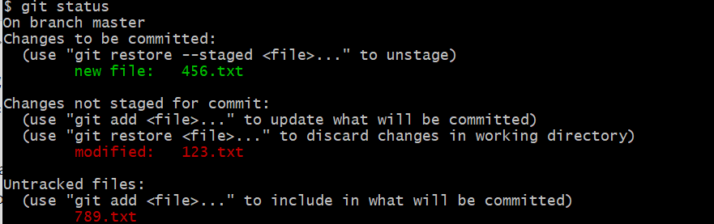
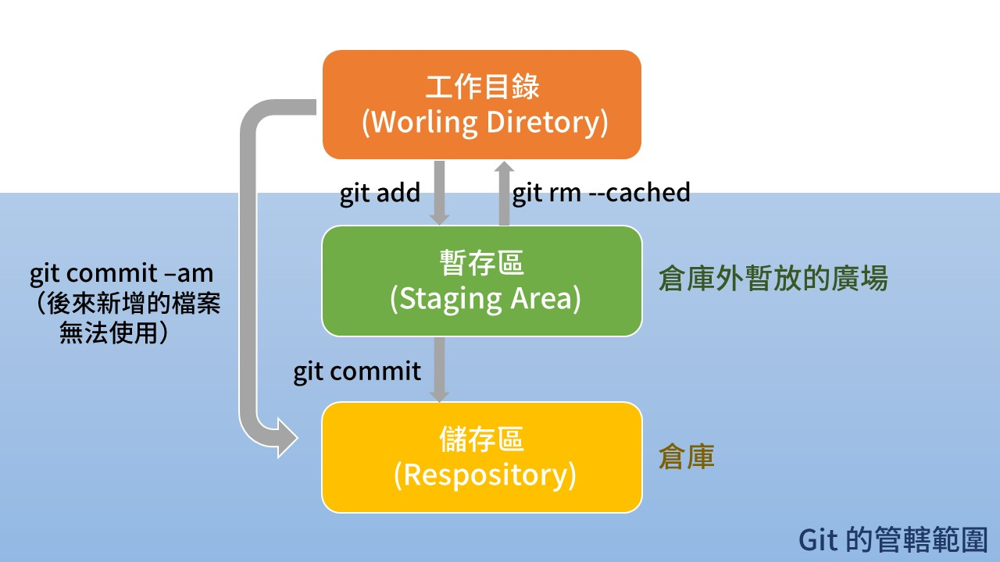
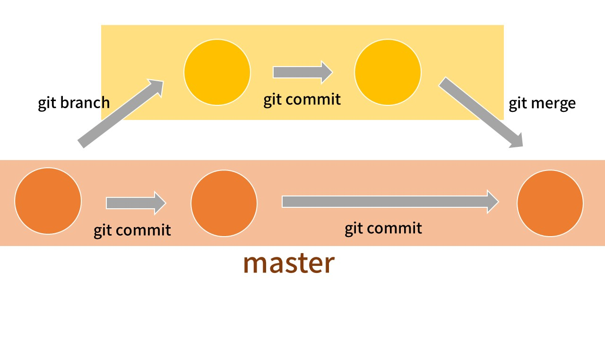

## 什麼是 Git ？

Git 是一種版本控制的系統。結束。

**——等等，那什麼又是版本控制？**

玩遊戲時可以將進度存檔，要是之後被打死就可以回到這個紀錄時間點重來。另外像是寫報告時會出現 `報告_final.docx`、`報告_final_final.docx`、`報告_final_final_final.docx`，其實就是版本控制的概念。


###### （圖為 Undertale 的存檔畫面，只是想放點有趣的東西增加學習動機）

> 工作時很多人負責同一個專案出問題，想知道誰在哪個時間點寫錯程式碼嗎？或是正在開發新功能同時需要修 bug ，兩者必須分開進行又不想刪掉手邊正在開發的新功能嗎？版本控制都能輕鬆讓你回到世界還很單純的時刻 (?)

無論是自己還是多人版本控制，東西太多時就會混亂，就需要有個系統幫忙進行版本控制，而 Git 就是這樣的一個系統。

## 從零開始思考版本控制

在了解 Git 之前，先試著想想如果要設計一個管理版本控制的系統，會需要甚麼樣的架構？

### 可能情況一：

同時管理兩個以上有關聯的檔案，如果每個檔案的版本分開紀錄，資料夾很有可能會變成這樣：

```
這個檔案.txt
這個檔案_版本二.txt
那個檔案.txt
那個檔案_版本二.txt
那個檔案_版本三.txt
```

然後你同事轉過來問你：「ㄟ當初那個檔案的版本二，是對應到這個檔案的哪個版本啊？」結果你也忘記，尷尬。

**解決方法：**

大家捆起來一起做版本紀錄，就像是把全部的東西放進資料夾裡面，最後主目錄會變成這樣：

```
專案資料夾（內含這個檔案.txt、那個檔案.txt）
專案_版本二資料夾（內含這個檔案.txt、那個檔案_版本二.txt）
專案_版本三資料夾（內含這個檔案_版本二.txt、那個檔案_版本三.txt）
```

### 可能狀況二

五個人同時負責同個專案，版本名稱好像不能單純用數字命名了。

**解決方法：**

不要糾結命名方法了， Git 直接亂數命名，然後開一個檔案紀錄版本們的時間和修改者等資料，還有一個檔案紀錄哪個是最新版本。

## 說了那麼多，終於要開始使用 Git 了

推薦使用 Git Bash ，下載方式可參考我之前寫的： [初學 Command Line](./command-line)

### 常用指令整理

| 指令            | 功能               | 其他                                     |
| --------------- | ------------------ | ---------------------------------------- |
| git init        | 初始化             | 成功後會建立 `.git` 的隱藏資料夾         |
| git status      | 看狀態             |                                          |
| git add         | 將檔案加入版本控制 |                                          |
| git rm --cached | 將檔案移除版本控制 | 若沒加 `--cached` 會直接刪掉檔案，要小心 |
| git commit      | 建立新的版本       | 最後可加 `-m "敘述"` 可對 commit 做說明  |
| git log         | 查看歷史紀錄       |                                          |
| git checkout    | 回到某個版本       |                                          |
| git branch      | 和 branch 有關     | 可直接加名稱新增 branch                  |
|                 |                    | `-v` 查看現在有哪些 branch               |
|                 |                    | `-d` 刪除 branch                         |
| git branchout   | 切換 branch        |                                          |
| git merge       | 合併 branch        | 把 branch 合併進來                       |

### init

首先要讓　 Git 連接資料夾，確認位置在目標資料夾後輸入：

```
$ git init
```

之後輸入 `ls -a` 查看所有檔案，會發現多了一個 `.git` 的隱藏資料夾，就表示初始化成功了。

### status

```
$ git status
```

可查看現在 Git 內的狀況。

## Git 運作方式

Git 可以的工作區塊可以分成三個，分別是`工作目錄 (Worling Diretory)` 、`暫存區 (Staging Area)` 和 `儲存區 (Respository)`。

可以把儲存區想成一個倉庫，每次有或從外面（工作目錄）送進來前，都會先放在倉庫前面的廣場（暫存區），都好了才開門一次放進倉庫，這樣除了倉庫門不用開開關關外，裡面的人也比較好清點貨物。

### 如何解讀 status

以下圖為例



`On branch master` ：目前沒有分支。  
`Changes to be committed`：將要提交的檔案。也就是在廣場捆好等倉庫門打開就可以直接運送進去的檔案。
`Changes not staged for commit`：被更動尚未要提交的檔案。其實也在廣場，只是門打開時無法被送進去。
`Untracked files`：未被追蹤的檔案。還沒進入廣場。

### 常用指令

區域之間的關係和移動檔案的方法，可以用下圖解釋：



#### 加入／移出版本控制

```
$ git add "欲加入檔案名稱"
```

`git add` 可將檔案從 untrscked 的狀態加入版本控制。
與之相反的是：

```
$ git rm "欲移出檔案名稱" --cached
```

記得一定要加 `--cached` ，不然檔案會被刪掉。

> 小技巧：  
> 對象是所有檔案時，可使用　`.` 或 `-all`，不用一個一個輸入。  
> 兩者差異可參考：[把檔案交給 Git 控管](https://gitbook.tw/chapters/using-git/add-to-git.html)

**細節：**暫存區的檔案修改完後，要再 `add` 一次，不然不會 commit。

#### 增加新的版本

在廣場準備得差不多了，可以打開倉庫門將檔案存入做為新的版本：

```
$ git commit (欲放入 respository 的檔案)
```

enter 後會進入 vim ，這時可以輸入對這個新版本的敘述，完成後就算是建立一個新的版本了。  
`git commit -a` ：將暫存區所有檔案一起存入新 commit 。  
`git commit (欲放入 respository 的檔案) -m "敘述"` ：不用進入 vim ，直接寫好 commit 的附註。  
`git commit -am "敘述"` ：上面兩者的合體技，一起存入後寫好附註。

#### 查看歷史紀錄

```
$ git log
```

會出現各個版本的歷史紀錄，比較新的 commit 會在上方，其中顯示的格式如下：

```
commit 457d6edf9bd8355014956d497f8617980b76cf9f   #幾乎沒有意義的名稱
Author: 編輯者名字 <編輯者信箱>
Date:   Fri Jun 19 17:38:55 2020 +0800  #最後修改時間

    123   #說明

```

如果想看比較簡潔的，可以用 `git log --oneline` ，歷史紀錄會以 `名稱前五碼 說明` 的形式條列。

#### 切換到某個版本

想切到某個版本，可以用：

```
$ git chechout (欲切回版本名稱)
```

如果要切回最新版本，可用 `git checkout master` 。

#### 要忽略的檔案

有些檔案（例如說明文件）雖然在資料夾內，但不太常修改，因此我們不想將它加入 Git 中，此時可以將它加入 `.gitignore` 中。  
首先用 `vim .gitignore` 打開文字編輯器，進入 vim 後輸入欲加入的檔名後離開就算完成了。之後就算使用 `git add .` 也不會將這些檔案加入 Git 了。

## 複習

### 下載完 git 後，如何將檔案移入 commit

1. 在目標資料夾下，用 `git init` 初始化 Git 。
2. 設定不想加入 Git 的 `.gitignore` 。
3. `git add .` 將所有檔案放入暫存區（倉庫前廣場），然後再 `git commit -m` 建立新的版本（塞進倉庫）。
4. 上個步驟也可合併成 `commit -am` ，但要注意若有新增的檔案，還請乖乖使用 `git add` 。
   **額外補充：** `git giff` 可以看不同版本之間的差異。

更基礎的 Git 觀念，可參考前一篇[[DAY8] 初學 Git （上）](https://v61265.coderbridge.io/2020/06/20/4c13890b64854625bfb0254737aa6f14/)
**這篇會介紹：**

1. branch 觀念和常用指令
2. GitHub 和 GitHub Flow
3. 各種其他 Git 狀況
4. 第四期程式導師計畫交作業方法

## branch ——世界線的開展與收束

### branch 是什麼？

某天你正在寫新功能，此時有一個 bug 需要緊急修復，現在你面對到一個問題：當你回傳 bug fix 時，不可能連正在開發的新功能一起完成——這樣新功能的檔案該放哪？  
branch 可以面對這個狀況。

### 怎麼理解 branch

可以把 branch 想成創造分身／另一個世界線的概念，先把開發中的新功能放到那個分身／平行世界中，等 bug fix 結束，再合併回來，這樣如果過程中發生了無法回復的傷害，也可以乾脆不要這個分身／平行世界。因此 branch 也廣泛用於多人共同編輯的專案上。  
這個網站可以讓大家模擬 branch 的運作方法： [Learn Git Branching](https://learngitbranching.js.org/index.html?locale=zh_TW)

### 常用指令



### 建立和刪除 branch

```
$ git branch (新 branch 名稱)
```

`git branch -v`：查看現在有哪些 branch 。

```
$ git branch -d (欲刪除 branch 名稱)
```

### 切換 branch

相對於切換 commit 的 `git checkout` ， branch 上的切換是：

```
$ git checkhout (欲切換 branch 名稱)
```

### 合併 branch

```
# git merge (欲合併 branch 名稱)
```

`merge` 是將後方 branch 合併進現在的 branch 。因此若要將 branch1 合併進 master ，就要先切換到 master ， 再輸入`git merge branch1`。  
不過誰合併誰實際上似乎不會有太多差異，只會在系統紀錄上有細微差別（新的 commit 誰的名字在前面）。

### 合併時遇到衝突怎麼辦

若 master 和欲合併的 branch 中都有更改過某個檔案，合併時可能會出現：

```
Auto-merging 456.txt
CONFLICT (content): Merge conflict in 456.txt
Automatic merge failed; fix conflicts and then commit the result.
```

這就表示兩個版本在 `456.txt` 做了不同的更改， Git 不知道要以哪個為優先。此時打開 `456.txt` 會看到有衝突的地方會顯示：

```
<<<<<<< HEAD
123123
=======
hihihi
>>>>>>> new
```

手動修改留下最後想要的版本，再 commit 就可以了。

## GitHub 和 Git flow

### GitHub

當多人協作版本控制時，就需要一個地方 .git 的資料夾。 Git 是版本控制的程式，而 GitHub 就可以是放 Git respository 的地方。  
https://gitbook.tw/chapters/github/push-to-github.html

#### 開始使用 GitHub

首先要把本地（你的電腦）內的 Git 連接上 GitHub ：

```
$ git remote add origin (repository位址)
```

這裡的 `remote` 是遠端的意思， `origin` 則只是代號。

#### 上傳

本地（你的電腦）和雲端 (GitHub)並不是連動的，可想像成 Google 雲端硬碟和電腦裡的檔案，因此時常需要手動同步。  
這裡指令的邏輯是從本地出發，因此上傳要用推(push)，下載要用拉(pull)。

```
$ git push orgin master
```

你可能會想「啊我就不想打那麼多字啊」，這樣可以一開始就用 `git push -u orgin master`設定好 `upstream` ，之後只打 `git push` ， Git 就會預設你要上傳到 upstream ，這裡 GitHub 會建議你一開始設定 master 為 upstream。

#### 下載

如果已經有權限，就用：

```
$ git pull orgin master
```

可能會產生衝突，此時就用上面 merge 遇到衝突的方法，一樣手動解決即可。  
但如果想下載別人在 GitHub 上的檔案，則要用：

```
$ git clone (網址)
```

如果沒有權限是不能再把東西 push 上去的，此時就可以使用 `fork` 的功能。

### Git Flow

Git flow 是一套使用 Git 工作的流程，現在已經有許多不同的 Git flow 出現，以下介紹 [GitHub 官網提供](https://guides.github.com/introduction/flow/) 的版本。  


1. 開一個新的分支
2. 建立 commit
3. pull request
4. 其他人 review
5. 合併回 master

最後可以 pull 回來，並 `git branch -d` 將剛剛開的 branch 刪掉。

## 其他 Git 狀況

### 修改 commit 說明

想要改 commit 的說明文字，可以輸入：

```
$ git reset --amend
```

之後進入 vim 編輯器修改就可以了。

### 修改 commit 內容

如果已經 commit 但後悔了，可以使用：

```
$ git reset HEAD^
```

`HEAD` 是用來存放「最新檔案資訊的」檔案， `^` 代表前一個的意思，也就是將最新檔案資訊 reset 到前一個。
如果之前修改的檔案都不要了，可在後面加一個 `--hard` 。否則會自動預設 `--soft` ，也就是雖然 commit 消失，但檔案還是被改動過的樣子。

### 回復檔案狀態

還沒 commit 前，若想回復檔案到上一個 commit 的狀態，可輸入：

```
$ git check --(欲回復檔案名)
```

### 改 branch 名稱

```
$ git branch -m (新的名稱)
```

### 把 branch 抓下來

想將遠端的 branch 抓到本地，可輸入：

```
$ git pull origin (欲抓 branch 名稱)
```

### Git Hook

Hook 是鉤子的意思，在程式中看到 Hook 就是勾住某樣東西，發生變化時通知我。例如 Git 的 pre-commit Hook 就是在 commit 前檢查是否符合規範，若違反就無法 commit 。

## 第四期程式導師計畫交作業方式

1. 把雲端上的最新版本抓下來 `git pull origin master` ，確保和最新狀況一樣等等才能順利上傳。
2. 開一個新 branch `git branch (branch name)` 並切換過去 `git checkout (branch name)` 。也可用組合技 `git branch -b (branch name)`。
3. 在自己的電腦裡編輯作業，寫寫寫。（記得要檢查）
4. 寫完之後建立一個新 commit `git commit -am "說明"` ，若有新增的檔案則用 `git add .` 和 `git commit -m "說明"`。
5. 把檔案上傳 `git push origin (branch name)` 。
6. 在 GitHub 上 pull requst 。
7. 到系統作業列表新增作業。
8. 等助教 merge 。
9. 切回 master `git checkout master`。
10. 把最新檔案抓下來 `git pull origin master`
11. 刪掉本地的 branch `git branch -d (branch name)`

## 和 Huli 的 master 同步

1. 先 checkout 到 master ，確定沒有任何東西需要 commit 。
2. 把 Huli 的資料 pull 下來。
3. push 到自己的 master。

#### 參考資料：

[為你自己學 Git](https://gitbook.tw/)  
[檔案狀態](https://zlargon.gitbooks.io/git-tutorial/content/file/status.html)
