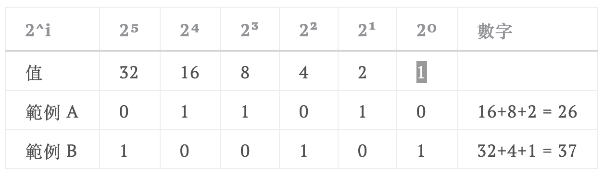

### JavaScript 是什麼？

是一套程式語言，因為幾乎沒有程式基礎，此時先了解 [性質](https://hackmd.io/6IxGWa3eQtGWWCeIC8yZOA?both/) 也沒有太多意義。因此就直接開始吧。

### 安裝環境： Node.js

下載方法： [官網](https://nodejs.org/en/)  
安裝完成後在 Command Line 輸入 `node -v` ，如果成功會出現版本號，如：

```
$ node -v
v14.4.0
```

在 Commend Line 輸入 `node` ，即可進入編輯模式，之後按 `Ctrl + C` 離開。也可以用 `node + 檔案名稱` 進入 vim 編輯器編輯 .js 檔案。

### Hello World

如果想要讓結果顯示出 `Hello World` ，可以使用：

```js
console.log(欲顯示文字);
```

如果想顯示數字可以直接輸入，但如果想顯示字串（之後會介紹分類），要記得字串前後加單引號 `'`　或雙引號 `"` 。

### 基本運算

通常是從右到左運算，另外像是先乘除後加減之類的，運算符號之間也有 [優先順序](https://www.fooish.com/javascript/operator.html) 。但保險起見，可以用小括號 `()` 標示出要先算的地方。

#### 數學運算

| 符號 | 功能 | 例子        |
| ---- | ---- | ----------- |
| +    | 加   | 4 + 3 > 7   |
| -    | 減   | 5 - 2 > 3   |
| \*   | 乘   | 3 \* 7 > 21 |
| /    | 除   | 10 / 2 > 5  |
| %    | 餘數 | 7 % 3 > 1   |

#### 邏輯運算

##### 邏輯運算可放什麼

一般來說就是放可以對應到真假值的運算（如 `true` 或 `4 - 3 == 1`）。另外若在 or 和 and 放數字或字串，會顯示 **誰決定句子真假**。

##### or

JavaScript 中的 or 是用 `||` 表示。  
以下是 a || b 的真值表：（用 0 表示 false ， 1 表示 true）

| a   | b   | a or b |
| --- | --- | ------ |
| 1   | 1   | 1      |
| 1   | 0   | 1      |
| 0   | 1   | 1      |
| 0   | 0   | 0      |

```
> true || true
true
> true || false
true
> false || true
true
> false || false
false
```

**誰決定句子真假：**  
通常除了 0、null 以外幾乎所有字都對應到 true。  
上方真值表可看出，若前者為真，後面不管是誰都無所謂；但若前者為假，句子的真假則由後者決定。因此：

```
> 33 || 10
33
> 33 || 0
33
> 0 || 33
33
> 0 || 0
0
```

##### and

JavaScript 中的 and 是用 `&&` 表示。  
以下是 a && b 的真值表：（用 0 表示 false ， 1 表示 true）

| a   | b   | a && b |
| --- | --- | ------ |
| 1   | 1   | 1      |
| 1   | 0   | 0      |
| 0   | 1   | 0      |
| 0   | 0   | 0      |

```
> true && true
true
> true && false
false
> false && true
false
> false && false
false
```

**誰決定句子真假：**  
上方真值表可看出，若前者為真，後者的真假會決定句子的真假；但若前者為假，無論後者真假，句子都是假的。因此：

```
> 33 && 10
10
> 33 && 0
0
> 0 && 33
0
> 0 && 0
0
```

##### not

JavaScript 中的 not 是用 `!` 表示。  
以下是 !a 的真值表：（用 0 表示 false ， 1 表示 true）

| a   | !a  |
| --- | --- |
| 1   | 0   |
| 0   | 1   |

```
> ! true
false
> ! false
true
```

**後面放其他東西的話：**  
會將字轉換成真假值後直接顯示真假值

```
> ! 882
false
> ! 0
true
```

### 位元運算

二進位法是電腦最原始的形式，因此直接使用二進位法溝通是最有效率的。  

[資料來源](https://hackmd.io/6IxGWa3eQtGWWCeIC8yZOA?both/)

#### 左右位移

二進位的 0100 是 2 的 3 次方、1000 是 2 的 4 次方。可推斷往左移就是乘以二的幾次方，右移則是除以二的幾次方。  
`<<` ：左移。  
`>>` ：右移。

```
> 10 << 1   #10 左移一次（乘以 2 一次)
20
> 8 >> 2    #8 右移兩次（除以 2 兩次，也就是除以 4）
2
```

#### 位元運算

概念：將兩個數字拆成位元，每個位置再各自使用邏輯規則比對出新的位元，最後轉換回數字。

##### and

位元運算的 and 用 `&`表示。  
例如 `10 & 15` 會輸出 0 。

| 數字    | 8   | 4   | 2   | 1   |
| ------- | --- | --- | --- | --- |
| 10      | 1   | 0   | 1   | 0   |
| 15      | 1   | 1   | 1   | 1   |
| 10 & 15 | 1   | 0   | 1   | 0   |

**位元遮罩：**  
因為 1 只有最後一位有數字，如果某數 `a & 1` 等於一，表示 a 轉換位元後在 1 的位置上有數字，也就是說他是奇數。

##### or

位元運算的 and 用 `|`表示。  
例如 `10 | 15` 會輸出 15 。

| 數字    | 8   | 4   | 2   | 1   |
| ------- | --- | --- | --- | --- |
| 10      | 1   | 0   | 1   | 0   |
| 15      | 1   | 1   | 1   | 1   |
| 10 & 15 | 1   | 1   | 1   | 1   |

##### xor

位元運算的 and 用 `^`表示。  
xor 的真值表如下：

| a   | b   | a ^ b |
| --- | --- | ----- |
| 1   | 1   | 0     |
| 1   | 0   | 1     |
| 0   | 1   | 1     |
| 0   | 0   | 0     |

因此`10 ^ 15` 會輸出 5 。

| 數字    | 8   | 4   | 2   | 1   |
| ------- | --- | --- | --- | --- |
| 10      | 1   | 0   | 1   | 0   |
| 15      | 1   | 1   | 1   | 1   |
| 10 & 15 | 0   | 1   | 0   | 1   |

##### not

位元運算的 not 用 `~` 表示。  
不過因為 10 的位元 並不只有 `1010` ，而是 `00000(略)1010` ，因此 `~10` 等於 -16 。
